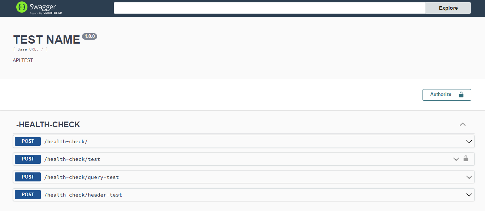
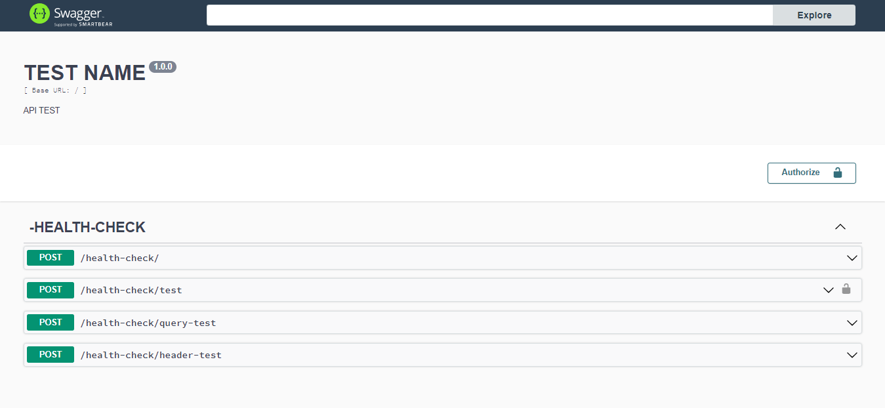
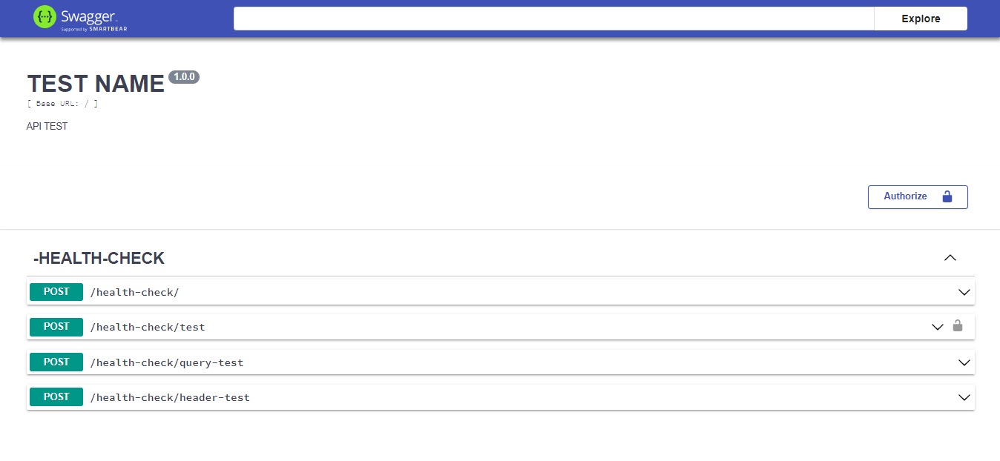
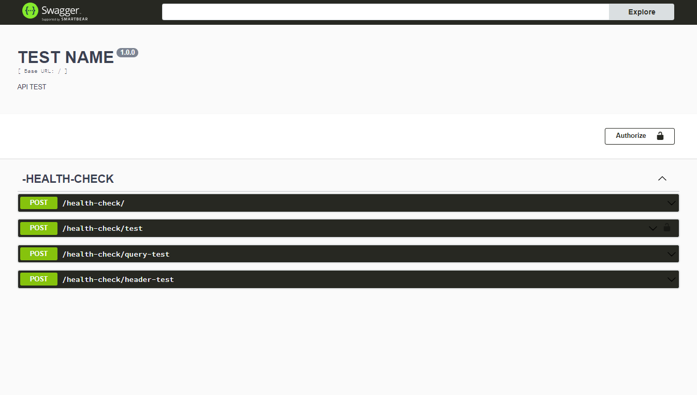
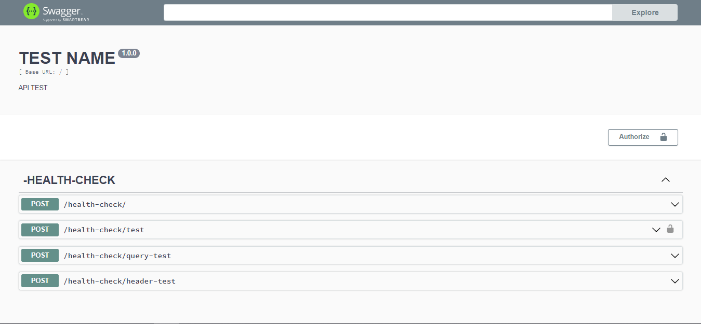
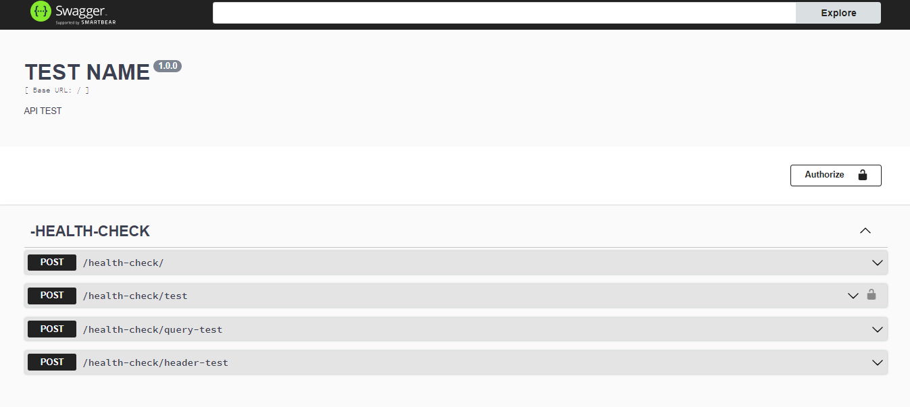
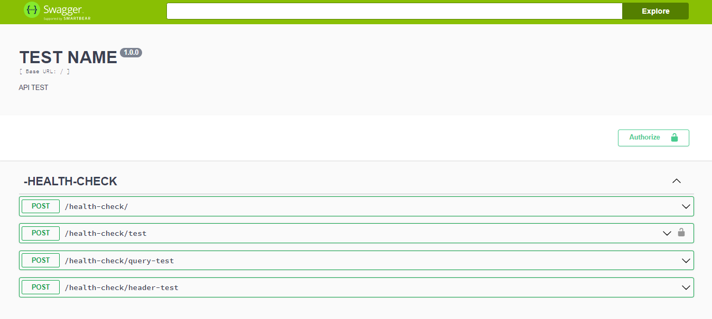

# Summer-glove

[](https://www.npmjs.com/package/summer-glove)
##  Fit like a glove 🧤
Summer-glove is a route manager, providing a quick and easy way to configure an express application. Summer-glove also provides 100% automated and customizable swagger documentation.
## Installation and Usage
```jsx
npm i summer-glove
```
## To create a app
```jsx
npx summer-glove --create-app
```
Will be create 
```
project/
├── App.ts
├── Controller.ts
├── Server.ts
├── tsconfig.json
```
Add the property below to your file **tsconfig.json**.
```json
{
    "compilerOptions": {
        //...
        "experimentalDecorators": true
        //...
    }
}
```
## Documentation
Below is a walkthrough of all available decorators

### Frist Configuration:
* **@SwaggerInitializer** - Loads Swagger in your express application  | String
* **@SwaggerEndpoint** - Defines the path to access documentation | String
* **@ApiDefaultPath** - Defines the main path of your API | String
* **@Description** - Describes your application within documenta*tion | String
* **@Title** - Puts a title on your documentation | String
* **@Version** - Defines API version | String
* **@GlobalAuth** - Defines if the API uses JWT Tokens as a security mechanism | Boolean
  * Param:
    * AuthType.BEARER_JWT
    * AuthType.BASIC
* **@ExpressInitializer** - Initializes an express app and configures its routes. You can also pass a logger configuration
  * Param:
    * LoggerConfigTypes.SHOW
    * LoggerConfigTypes.HIDE

### Second Configuration
* **@Controller** - Specifies a controller within the express context | String

### Third Configuration
* **@Get** - Specifies GET type endpoints  | String, middlewares
* **@Post** - Specifies POST type endpoints | String, middlewares
* **@Delete** - Specifies DELETE type endpoints | String, middlewares
* **@Patch** - Specifies PATCH type endpoints | String, middlewares
* **@Put** - Specifies PUT type endpoints | String, middlewares
* **@Connect** - Specifies CONNECT type endpoints | String, middlewares
* **@Head** - Specifies HEAD type endpoints | String, middlewares
* **@Options** - Specifies OPTIONS type endpoints | String, middlewares
* **@Trace** - Specifies TRACE type endpoints | String, middlewares

### Fourth Configuration
* **@StatusResponse** - Adds HTTP response codes and description | number
* **@Body** - Adds a Body as a request object | Object
* **@RequireAuth** - Tells swagger that the route is protected by authentication
* **@ParamPath** - Adds a ParamPath as a request object | Object
* **@FormData** - Adds a FormData as a request objet | Object. Utilize *FormDataTypes* for grant types
* **@Header** - Adds a Header as a request objet | object
* **@Query** - Adds a Query as a request objet | object
*
### Themes
To configure the themes, use
* **@Theme** - Specifies Theme type of Swagger | If not specified, use default swagger theme
    * ThemesType.FEELING_BLUE
    * ThemesType.FLATTOP
    * ThemesType.MATERIAL
    * ThemesType.MONOKAI
    * ThemesType.MUTED
    * ThemesType.NEWS_PAPER
    * ThemesType.OUTLINE

## Usage

### Express & Swagger Configuration
```javascript
import Express from "express";
import {
  ApiDefaultPath,
  Description,
  ExpressInitializer,
  GlobalAuth,
  AuthType,
  LoggerConfigTypes,
  SwaggerEndpoint,
  SwaggerInitializer,
  Theme,
  ThemesType,
  Title,
  Version
} from "../src/index";
import MyController from "./Controller";
import express from "express";

@SwaggerInitializer
@SwaggerEndpoint("/doc") //
@Description("API TEST")
@Title("TEST NAME")
@Version("1.0.0")
@ApiDefaultPath("/")
@GlobalAuth(AuthType.BEARER_JWT)
@Theme(ThemesType.NEWS_PAPER)
export default class App {

  @ExpressInitializer(LoggerConfigTypes.SHOW)
  private app: Express.Express = express();

  constructor () {
    this.initControllers();
  }

  private initControllers(){
    new MyController1()
    new MyController2()
  }

  public getApp(): Express.Express {
    return this.app;
  }
}
```
### Controller Configuration
```javascript
@Controller("/controller1")
export default class MyController1 {
    
    //health-check
    @StatusResponse(200, "Check API successfully")
    @StatusResponse(400,"Check API unsuccessfully")
    @Get() // It is important to put the Http Method Decorator as the first configuration.
    public check(request: Request, response: Response): Promise<Response> {

        //... implementation

    }
}
```
```javascript
@Controller("/controller2")
export default class MyController2 {
    
    
    @StatusResponse(202) // if you dont pass description, express-swagger-autoconfigure add for you 
    @StatusResponse(400) // if you dont pass description, express-swagger-autoconfigure add for you 
    @Body({email:"Description", password:"Description"})
    @Post("/login")// It is important to put the Http Method Decorator as the first configuration.
    public login( request: Request, response: Response): Promise<Response> {
       //... implementation
    }
    
    @StatusResponse(200) // if you dont pass description, express-swagger-autoconfigure add for you 
    @StatusResponse(400)// if you dont pass description, express-swagger-autoconfigure add for you 
    @Get("/", authorizationMiddleware)// It is important to put the Http Method Decorator as the first configuration.
    public read(request: Request, response: Response): Promise<Response> {
        //... implementation
    }

    @StatusResponse(200)// if you dont pass description, express-swagger-autoconfigure add for you 
    @StatusResponse(400)// if you dont pass description, express-swagger-autoconfigure add for you 
    @ParamPath({uuid: "Description"})
    @RequireAuth() // Tells swagger that the route is protected by authentication
    @Get("/find-by-uuid/{uuid}", authorizationMiddleware)// It is important to put the Http Method Decorator as the first configuration.
    public findByUuid(request: Request, response: Response): Promise<Response> {
        //... implementation
    }

    @StatusResponse(200)// if you dont pass description, express-swagger-autoconfigure add for you 
    @StatusResponse(400)// if you dont pass description, express-swagger-autoconfigure add for you 
    @Body({
        name : "Description",
        email : "Description",
        password: "Description"
    })
    // Default = "/" 
    @Post() // It is important to put the Http Method Decorator as the first configuration.
    public create(request: Request, response: Response): Promise<Response> {
        //... implementation
    }
    
    @StatusResponse(200)// if you dont pass description, express-swagger-autoconfigure add for you 
    @StatusResponse(400)// if you dont pass description, express-swagger-autoconfigure add for you 
    @Query({
        uuid:"Description"
    })
    // Default = "/" 
    @Post("/query-profile") // It is important to put the Http Method Decorator as the first configuration.
    public queryProfile(request: Request, response: Response): Promise<Response> {
        //... implementation
    }

    @StatusResponse(200)// if you dont pass description, express-swagger-autoconfigure add for you 
    @StatusResponse(400)// if you dont pass description, express-swagger-autoconfigure add for you 
    @Header({
        profileType:"Description"
    })
    // Default = "/" 
    @Post("/type-profile") // It is important to put the Http Method Decorator as the first configuration.
    public headerProfile(request: Request, response: Response): Promise<Response> {
        //... implementation
    }

    @StatusResponse(200)// if you dont pass description, express-swagger-autoconfigure add for you 
    @StatusResponse(400)// if you dont pass description, express-swagger-autoconfigure add for you 
    @FormData({
        img: FormDataTypes.FILE,
        name: FormDataTypes.STRING,
        rules: FormDataTypes.ARRAY,
        age: FormDataTypes.NUMBER,
        isMarried:FormDataTypes.BOOLEAN

    })
    // Default = "/" 
    @Post("/create-profile") // It is important to put the Http Method Decorator as the first configuration.
    public createProfile(request: Request, response: Response): Promise<Response> {
        //... implementation
    }
}
```

## Theme examples
* **FEELING_BLUE**
  
* **FLATTOP**
  
* **MATERIAL**
  
* **MONOKAI**
  
* **MUTED**
  
* **NEWS_PAPER**
  
* **OUTLINE**
  

## Contact
_victorqueiroz90@outlook.com_
